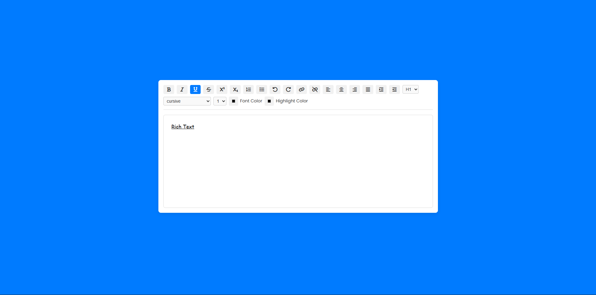

<div align="center">
  <h1>Text Editor</h1>
  <p>A minimal, fast and clean in-browser text editor built with vanilla JavaScript.</p>
  <strong>Formatting · Lists · Colors · Links · Alignment · Shortcuts</strong>
  <br><br>
</div>

---

## Overview

Text Editor — это простой, быстрый и функциональный редактор текста, работающий прямо в браузере.  
Он создан без фреймворков — только **HTML, CSS и JavaScript**, что делает его лёгким и полностью кастомизируемым.

Проект похож на мини-версию Google Docs и подходит для обучения DOM, событий, форматирования текста,  
а также для понимания логики rich-text редакторов.

---

## Features

- **Text Formatting**
  - Bold, Italic, Underline, Strikethrough
- **Scripts**
  - Superscript / Subscript
- **Lists**
  - Ordered / Unordered
- **History**
  - Undo / Redo
- **Links**
  - Create / Remove hyperlinks
- **Text Alignment**
  - Left, Center, Right, Justify
- **Indentation**
  - Indent / Outdent
- **Typography**
  - Font family  
  - Font size  
  - Text color  
  - Highlight color  
- **Live Editing**
  - Fully real-time updates  
  - Clean UI and responsive layout

---

## Demo
> 

---

## Tech Stack

| Layer | Tech |
|-------|------|
| UI | HTML5, CSS3, Font Awesome |
| Logic | Vanilla JavaScript |
| Editing API | `document.execCommand()` |
| Fonts | Google Fonts |

---

## Getting Started

Clone the project and open it locally:

```bash
git clone https://github.com/your-username/text-editor
cd text-editor
Просто открой index.html в браузере
```
---

MIT License — свободное использование и модификация проекта.

---

``` <div align="center"> <sub>Build something great. Deploy anywhere.</sub> </div> ```

---

👨‍💻 Автор

Exmar — Fullstack Developer

📧 Telegram: @Exmar1
